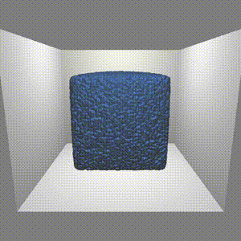
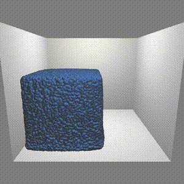
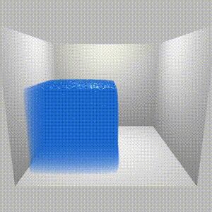
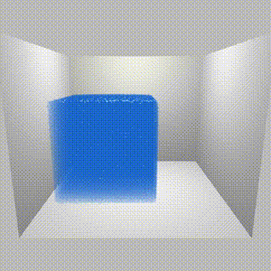

# Position Based Fluids
My implementation of [Position Based Fluids](https://mmacklin.com/pbf_sig_preprint.pdf) for fluids simulation and [Screen Space Fluid Rendering with Curvature Flow](https://www.cs.rug.nl/~roe/publications/fluidcurvature.pdf) for particle-based fluids rendering.
# Gallery
 
 
 
 
# Performance
Using a GeForce RTX 3090, the simulation part with 262144 particles takes 0.012~0.015 seconds.

# Dependencies
- CUDA 11.6
- GLFW3 & glad
- GPU dirver support OpenGL 4.4
# Build & Run
- Build
``` C++
mkdir build
cd build
cmake ..
make
```
- Run
``` C++
./PBF {scene index} {render mode}
```
scene index : Index of simulation scene samples from 1 to 4  
render mode : Methods for rendering fluids 0(surface) and 1(particle)  
eg:  
``` C++
./PBF 1 0
```
# References
- [1] [Position Based Fluids](https://mmacklin.com/pbf_sig_preprint.pdf) 
- [2] [Screen Space Fluid Rendering with Curvature Flow](https://www.cs.rug.nl/~roe/publications/fluidcurvature.pdf)